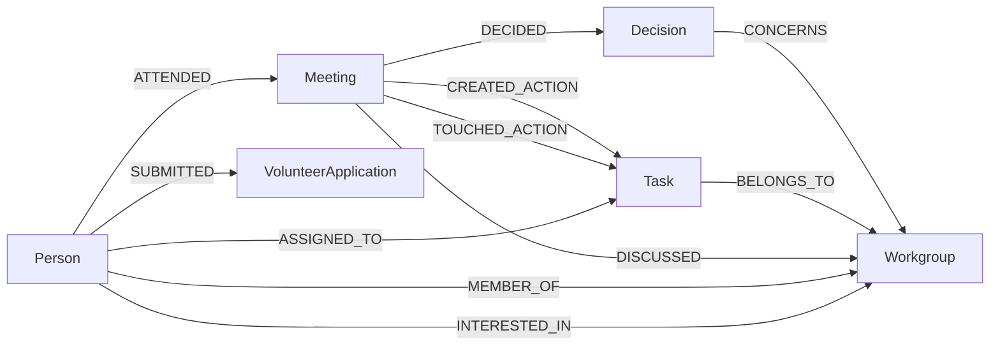

# SciPy India meeting-notes knowledge graph

Meeting notes are a graph pretending to be a document. Every dated section
records who ran the meeting, who turned up, what got decided, what has to happen
next and who owns it. Kept as prose in a Google Doc, you can full-text search it
and not much else. Six weeks in, nobody can tell you what is still open.

This reads that document and builds a graph out of it, then hands the graph to
two readers that never talk to each other:

```
meeting notes → CocoIndex → Neo4j ─┬─→ read-only MCP server → your local agent
                                   └─→ sanitized snapshot → static dashboard
```

The dashboard answers "show me what is going on" and is safe to publish. The MCP
server answers "help me work with what is going on" and stays on your laptop
next to the private graph. Neither depends on the other, and there is no backend
in between.

It started as CocoIndex's
[meeting_notes_graph_neo4j](https://github.com/cocoindex-io/cocoindex/tree/main/examples/meeting_notes_graph_neo4j)
example, which is where the pipeline shape comes from. The workgroups, the
volunteer applications, the provenance and the retrieval layer are ours.

Nothing here needs credentials to try. There are fixture notes and fixture
volunteer applications in the repo, a deterministic parser that reads them
without an LLM, and a committed snapshot that is enough to serve the dashboard.

## Get it running

You need Docker and Python 3.11 or newer. From a clean shell:

```bash
python -m venv .venv && source .venv/bin/activate
pip install -e ".[dev]"
cp .env.example .env
docker compose up -d --wait
./scripts/refresh.sh
python -m http.server 8000 --directory web/public
```

Open <http://localhost:8000>. `docker compose up -d --wait` blocks until Neo4j
answers on Bolt, so the refresh never races a database that is still booting,
and it takes about seven seconds. The refresh builds the graph, the search
indexes and the dashboard snapshot in that order.

If you also want an agent to be able to query the graph, run
`python scripts/print_mcp_config.py --write` and restart Claude Code in this
directory. That part is optional and covered further down.

## My normal workflow

I download the latest version of the notes Doc as Markdown into
`data/meeting_notes/`, replacing the file that is already there. Then:

```bash
./scripts/refresh.sh
```

That is the whole thing. CocoIndex notices which meeting sections changed and
re-extracts only those; the index builder re-embeds only the nodes whose text
changed; the exporter rewrites `web/public/data/graph.json`. It prints what
moved, so a refresh after a real meeting looks like this:

```
1/3  Graph
  ✅ process_note_file: 1 total | 1 reprocessed
  OpenTasks: 15 -> 16
  Task: 22 -> 23

2/3  Search indexes
  vector    task_embedding_index    1 embedded, 22 already current, 384 dims

3/3  Dashboard snapshot
  Wrote web/public/data/graph.json: 5 meetings, 10 people (5 withheld), 23 tasks
  privacy checks passed
```

`./scripts/refresh.sh --check` reports what is stale without changing anything.
`--no-search` skips the indexes, `--force` re-embeds everything, and `--watch`
re-runs the whole refresh whenever the notes change, which needs `fswatch`.

### About the filename

Downloading the Doc again usually gives you a new name: `SciPy India 2026
Meeting Notes (1).md` lands next to the one already there. Both get read, every
meeting appears twice, and nothing looks wrong until you count the open tasks. I
hit this while building the refresh script and the graph quietly went from 22
tasks to 50.

So the pipeline refuses it now. Two files claiming the same meeting date and
title is an error with both filenames in the message, not a silent merge. If you
overwrite the existing file, nothing special happens and the refresh is
incremental as usual. If you delete the old export first and the new one has a
different name, that also works: CocoIndex removes what the deleted file
contributed and adds the new file's meetings, so the graph ends up the same
either way.

If you would rather not think about it, set `MEETING_NOTES_FILE` in `.env` to
one canonical filename and always save over it. Anything else in the directory
is then ignored.

## Writing the notes

The format is in [docs/meeting-notes-template.md](docs/meeting-notes-template.md),
and it is meant to be typed during a call rather than filled in afterwards. It
is built out of plain labels because the same Doc reaches the pipeline as two
different things: downloaded by hand it is Markdown, read through the Google
Drive connector it is plain text with the headings and bullets stripped. Labels
survive both.

```text
Meeting: 2026-09-05 | Volunteer onboarding

Facilitator: Priya Vasudevan
Attendees: Priya Vasudevan, Meera Raghavan, Kabir Anand
Workgroups: Volunteers, Website & Tech

Topics

Volunteer applications received since the last call.

Decisions

The Volunteers workgroup will schedule a short intro call before assigning
new applicants to a workgroup.

Action items

Task: Schedule intro calls with the shortlisted volunteers
ID: volunteer-intro-calls
Workgroup: Volunteers
Owner: Priya Vasudevan
Status: open
Due: 2026-09-10

Task: Recruit additional CFP reviewers
Workgroup: Program & CFP
Owner:
Status: open
Due:
```

An empty `Owner:` means the meeting did not name one. It is not permission to
guess, and neither the parser nor the LLM extractor will fill it in. The task
comes out unassigned, which is the signal the whole "nobody assigned" view is
built on.

`ID:` is optional. Add one to a task you expect to carry across several meetings
or to reword later, and repeat the same ID with the new status each time. The
graph then keeps one task with a three-meeting history instead of three tasks.

The date has to be ISO. A section without one is treated as preamble, which is
how the document title and your links list stay out of the graph.

## What each piece is doing

Neo4j holds the private graph: meetings, people, action items, decisions,
workgroups and volunteer applications, including contact details and the
free-text answers people gave on the form. Nothing published ever comes from
here directly.

CocoIndex is the pipeline that fills it. It reads the notes, splits them into
meetings, extracts structure from each one, works out which names refer to the
same person, and declares the resulting nodes and edges. Because it memoises per
meeting section, editing one meeting re-extracts one meeting and leaves the rest
of the graph alone. Delete a file and its contributions come out cleanly.

The exporter is there because GitHub Pages is static and public, and the graph is
neither. `scripts/export_public_snapshot.py` queries Neo4j and writes a JSON file
containing only fields named in an allowlist, which makes it the gate between
the two halves of the project.

Then there is the MCP server, the other reader. It connects to the same Neo4j,
exposes eleven read-only tools, and lets an agent answer "what is still open in
Website & Tech" from the graph rather than by grepping the notes file. It runs on
your laptop and is not part of the Pages deployment.

Search indexes sit outside all of that and are optional. Full-text needs nothing
at all. Adding vectors turns the MCP server's search tool into hybrid retrieval,
and since the model runs locally there is still no API key involved. They need
rebuilding when the notes change, which `./scripts/refresh.sh` handles.

To stop everything: `docker compose down`. The graph rebuilds from the notes in
a few seconds, so throwing the container away costs nothing.

## The graph

Six node labels and ten relationship types, plus a singleton that records how
the graph was built.



| Node | Key | Properties |
| --- | --- | --- |
| `Meeting` | `id` | `note_file`, `date`, `title`, `summary`, `topics`, `section_index`, `source_ref`, `extraction_mode` |
| `Person` | `name` | canonical name after entity resolution |
| `Task` | `id` | `description`, `status`, `due`, `note_file`, `identity_basis`, `first_seen`, `last_seen`, `meeting_count`, `extraction_mode` |
| `Workgroup` | `slug` | `name`, `description` |
| `Decision` | `statement` | `note_file`, `first_seen`, `extraction_mode` |
| `VolunteerApplication` | `application_id` | `display_name`, `status`, `availability`, `interests`, `skills`, `submitted_on`, and the private `contact_email`, `contact_phone`, `raw_response` |
| `GraphBuild` | `id` | `built_at`, `pipeline_version`, `notes_source`, `volunteer_source`, `extraction_mode`, `person_resolution` |

Workgroups come from [config/workgroups.yaml](config/workgroups.yaml) and
nowhere else. That file also holds the aliases that let "Design", "design &
branding" and "Creatives" all land on one workgroup. A name that matches nothing
is dropped rather than invented, so an unregistered work area shows up as a gap
instead of a wrong edge.

### Decisions and action items are different things

The upstream example has no `Decision` node, so it spends `DECIDED` on the
meeting-to-task edge: there, a task *is* the thing that got decided. Once
decisions became their own nodes here that name stopped being true, so `DECIDED`
now points at the decision and action items get two edges of their own.
`CREATED_ACTION` marks the one meeting that first recorded an item.
`TOUCHED_ACTION` marks every meeting that mentioned it, carrying the status it
held at that point.

"Which meeting created this" and "how many meetings has this dragged through"
are now separate questions with separate answers, and the whole `open → blocked
→ in_progress` history lives in the graph rather than only in the prose. If you
know the upstream example, read `CREATED_ACTION` where you expect `DECIDED`.

### Task identity

Upstream keys a task by its description, and this project leaned on that: an
item repeated in a later meeting is the same item, which is how status moves
along. That recurrence is worth keeping. Description-only identity is not. Two
workgroups will eventually both write "Send the reminder email", and a
description-keyed graph merges them into one task with one status and two
unrelated owners without anything looking broken.

[src/scipy_india_kg/task_identity.py](src/scipy_india_kg/task_identity.py)
resolves a scoped key instead: an explicit `ID:` from the notes if there is one,
otherwise the workgroup plus the normalised description, otherwise the
description alone. Every key is also scoped to the source document so last
year's notes and this year's never merge. Normalisation folds case, whitespace
and trailing punctuation and nothing cleverer, because near-duplicate wording
staying two tasks is the safe direction to be wrong in. Which rule fired is
stored on the node as `identity_basis`.

### Provenance

Before trusting anything an LLM extracted you want to be able to ask why the
graph believes it, so every derived fact carries its source. `Meeting.source_ref`
points at `<note file>#section-<n>`. Meetings, tasks and decisions all record
which extractor produced them. `TOUCHED_ACTION` edges give a task's whole
appearance history with the status at each point, `ASSIGNED_TO.first_meeting_id`
credits the meeting that first named an owner, and `MEMBER_OF.source`
distinguishes a membership the team recorded in a meeting from one inferred from
a form field.

`./scripts/query get-task-history "Port the 2025 site"` prints all of it. Raw
source text is deliberately not copied into the graph, and none of this
provenance reaches the public snapshot beyond the build-mode names in the
dashboard footer.

## Asking the graph questions

`./scripts/query` is the CLI and `src/scipy_india_kg/mcp/` is the MCP server.
Both call the same `OrganizerGraph`, which is the only thing in the project that
holds retrieval Cypher, so a tool and its CLI twin cannot answer differently.

```bash
./scripts/query describe-graph
./scripts/query list-unassigned-tasks
./scripts/query get-workgroup-context "Website & Tech"
./scripts/query search "code of conduct" --json
```

The eleven tools, which are also the eleven CLI subcommands:

| Tool | Arguments | Answers |
| --- | --- | --- |
| `describe_graph` | | what this data is, where it came from, what search is available |
| `list_recent_meetings` | `limit=5` | the last few meetings |
| `get_meeting_context` | `meeting_id=None`, `date=None` | one meeting: attendees, decisions, action items with status transitions |
| `list_open_tasks` | `workgroup=None`, `owner=None`, `limit=50` | what is still open |
| `list_unassigned_tasks` | `workgroup=None`, `limit=50` | open work with no owner |
| `get_task_history` | `task`, `limit=3` | origin, source reference and status history for one item |
| `get_person_context` | `name` | one person: workgroups, open work, meetings, volunteer profile |
| `get_workgroup_context` | `workgroup`, `recent_meetings=3` | where a workgroup stands, in one call |
| `list_recent_decisions` | `workgroup=None`, `limit=10` | decisions, newest first, with their meetings |
| `find_interested_unassigned_volunteers` | `workgroup=None` | who asked for a workgroup and is still waiting |
| `search_organizing_graph` | `query`, `limit=10`, `kinds=None` | open-ended text search |

Everything is read-only, and not merely by convention: queries run under
`RoutingControl.READ`, so Neo4j rejects a write rather than trusting the caller.
There is no arbitrary-Cypher tool and no write tool of any kind.
[tests/test_graph_readonly.py](tests/test_graph_readonly.py) proves it by
attempting one.

### Connecting Claude Code or Claude Desktop

```bash
python scripts/print_mcp_config.py --write
```

That writes `.mcp.json` in the project root with your absolute paths filled in;
restart Claude Code in this directory and it picks it up. For Claude Desktop,
run the same script without `--write` and merge the `mcpServers` block into
`claude_desktop_config.json`, which lives in `~/Library/Application
Support/Claude/` on macOS and `%APPDATA%/Claude/` on Windows.

No credentials go in that file. The server reads `.env` from the project
directory it is launched in, which is where it already lives. `PYTHONPATH` is
set explicitly rather than relying on `pip install -e .`, because a `.pth` file
is a fragile thing to make a background process depend on.

Then you can ask things like "what open action items still have no owner", "what
did we decide about the website in the last three meetings", or "give me the
current context for Website & Tech". The last one is a single
`get_workgroup_context` call. "What changed between the two most recent
meetings" works because `get_meeting_context` returns each item with the status
it held at that meeting and at the previous meeting that touched it, so the diff
is a comparison rather than a replay.

### Search

```bash
python scripts/build_search_indexes.py               # full text, no models
python scripts/build_search_indexes.py --embeddings  # adds vectors, for hybrid
python scripts/build_search_indexes.py --status
```

Full-text costs nothing. `--embeddings` adds a vector index per label using a
local sentence-transformers model, so it needs a one-time model download and no
API key. Set `SEARCH_EMBEDDING_MODEL` to that model in `.env` and the server
upgrades itself to hybrid retrieval; leave it empty and it stays on full text.
A LiteLLM `provider/model` string works too if you would rather use a hosted
provider.

The strategy is chosen for the whole search rather than per label, because
ranking a cosine score for one label against a Lucene score for another produces
numbers that cannot be compared. `search_organizing_graph` is registered only
when an index exists that can serve it, so an agent is never handed a tool that
returns nothing.

Changing the embedding model re-embeds everything, because the model name is
part of the hash that decides what is current. If the new model produces vectors
of a different width the builder stops and tells you to add `--recreate`, since
Neo4j keeps an existing vector index rather than widening it and search would
otherwise go quiet instead of failing.

Volunteer application text is indexed by neither. Somebody's free-text answer
about themselves is not something to make semantically searchable by default.

## Live mode

```bash
cocoindex -d src update -L scipy_india_kg.main
```

This keeps **Neo4j** current and nothing else. It re-runs the pipeline every
`LIVE_REFRESH_SECONDS` (20 by default); memoisation makes a cycle with no edits
cost almost nothing, and a cycle after one edited meeting re-extracts that
meeting only. Polling rather than filesystem events, because person resolution
has to see every name before it can decide which ones are the same person, so
there is nothing useful to do with a single changed file on its own.

The dashboard snapshot and the vector embeddings are not touched by `-L`. I
checked: after an edit the graph said two unassigned tasks while `graph.json`
still said three. So `-L` is for working on the pipeline, and this is for
working on the notes:

```bash
./scripts/refresh.sh --watch
```

That re-runs the full refresh on every change, so the graph, the search indexes
and the dashboard all stay current together. It needs `fswatch`
(`brew install fswatch`).

## The privacy boundary

GitHub Pages is static and public, so the browser never talks to Neo4j and never
talks to the MCP server. The published file is produced by
[scripts/export_public_snapshot.py](scripts/export_public_snapshot.py), which
works from an allowlist: `PUBLIC_FIELDS` names every field that may be published,
per node label. Anything not named there cannot leak, including fields added to
the graph later.

There are two profiles. `public` is the default and the only one the Pages
workflow will deploy: nothing that originated in a volunteer application reaches
it, so no availability, no skills, no interests, and no names of people who
applied but have not been assigned. A person appears in it through work they did
in the open, and the site shows waiting volunteers as counts per workgroup.

```bash
python scripts/export_public_snapshot.py                       # public, committed
python scripts/export_public_snapshot.py --profile organizer   # private/, gitignored
```

`organizer` adds availability, skills and interests for people already on a
workgroup, which is useful when you are deciding who to ask about what. It
writes to `private/organizer-graph.json`, outside `web/` so it cannot be
deployed by accident, and the Pages workflow rejects any snapshot whose profile
is not `public`.

Also excluded from both: contact details, raw application answers, and
`note_file` paths into somebody's Drive. `--include-applicant-names` publishes
the waiting list by name, and you should only pass it if the form told
applicants their names would be public.

Fixture data makes the difference between the profiles look harmless. Real
applications are the reason the default is the strict one.

[tests/test_public_snapshot.py](tests/test_public_snapshot.py) enforces this
against the committed snapshot, and `./scripts/refresh.sh` runs those tests on
the file it just wrote.

## Using the real Google Doc

Two routes, and they behave differently enough to matter.

Downloading the Doc as Markdown by hand is what the fixture workflow assumes,
and the deterministic parser reads it directly. Pointing CocoIndex at the Doc
instead means setting `MEETING_NOTES_SOURCE=google_drive`, and the connector
exports Google Docs as **plain text**, not Markdown. Headings lose their `#` and
bullets disappear. That is why the template is built on labels rather than
markup, and why
[tests/test_note_formats.py](tests/test_note_formats.py) parses both
representations of the same meeting and asserts the results are identical.

For the Drive route you need a Google Cloud service account and its JSON key.
Share the Drive folder with the service account's email address, the one ending
`@project.iam.gserviceaccount.com`; this is the step people miss, and the API
returns an empty folder rather than an error. Then put the folder id from the
URL in `GOOGLE_DRIVE_ROOT_FOLDER_IDS`. CocoIndex's
[walkthrough](https://cocoindex.io/docs/connectors/google_drive/) is the
reference.

Whether to also switch to `MEETING_EXTRACTOR=llm` depends on how the notes get
written. If the team fills in the template, the deterministic parser handles the
plain-text export fine and is worth keeping for being predictable. If minutes
get taken as free prose, the LLM extractor is the only thing that will cope.
There is no live watching for Drive: the connector scans, so a refresh on a
schedule is the right shape there.

## Evaluating the LLM extractor

The deterministic parser is covered by tests. The LLM extractor has never been
run against anything in this repository, because there are no API credentials
here. `scripts/eval_extraction.py` is how to check it when you have a key.

```bash
export OPENAI_API_KEY=...
python scripts/eval_extraction.py --compare data/meeting_notes/scipy-india-2026-meeting-notes.md
python scripts/eval_extraction.py --ground ~/Downloads/"PyConf Hyderabad 2025 Meeting Notes.md"
python scripts/eval_extraction.py --resolution data/meeting_notes/*.md
```

`--compare` diffs the LLM against the deterministic parse on a document both can
read, so every difference is a nameable error. `--ground` audits LLM output
against the source text on prose minutes where there is no baseline; it cannot
tell you what the model missed, but it catches what it made up. `--resolution`
compares the two person resolvers over the same name set.

Without credentials the script exits 2 and says so rather than pretending. It is
not part of `pytest`, because it costs money and its output is a judgement call.

## Useful Cypher queries

Sixteen of them in
[queries/organizer_queries.cypher](queries/organizer_queries.cypher), for when
you want the raw graph rather than a typed result:

```bash
python scripts/run_queries.py --list
python scripts/run_queries.py -n unowned-tasks -n latest-changes
python scripts/run_queries.py --json > /tmp/report.json
```

Beyond the obvious ones, `latest-changes` diffs the two most recent meetings,
`task-identity-audit` lists action items that share a description and shows what
keeps them apart, and `provenance` traces every unowned open item back to the
meeting and document section it came from.

## Deploying the dashboard

Push to a repository under the `scipy-india` organization, then set Settings →
Pages → Source to **GitHub Actions**. The first deployment works on the committed
fixture snapshot with no secrets and no database.

For real data the simple route is to run the refresh on a laptop against the
real Doc, commit `web/public/data/graph.json`, and push. That keeps every
credential off GitHub. `.github/workflows/refresh-graph.yml` runs the pipeline in
Actions instead, but it needs a Neo4j the runner can reach, which a container on
your laptop is not.

The frontend has no build step. `web/public` is the deployable directory,
Cytoscape.js is vendored rather than pulled from a CDN, every URL is relative and
routing is done with the hash, so the site behaves the same at a project URL as
at the root. To check that before deploying:

```bash
mkdir -p /tmp/pages/<repo-name> && cp -R web/public/* /tmp/pages/<repo-name>/
python -m http.server 8000 --directory /tmp/pages
```

## Tests

```bash
pytest -q
ruff check . && ruff format --check .
```

Most of the suite needs nothing: the workgroup registry, both note formats, task
identity and its collision cases, person resolution, the volunteer adapters,
search capability detection and the privacy guarantees on the committed
snapshot. The rest need a populated Neo4j and skip cleanly without one, so CI
stays green on a runner with no database. Those cover the retrieval layer against
the live graph, read-only enforcement, and the MCP server driven through a real
client over stdio.

For the full set, bring up Neo4j and refresh first.

## Troubleshooting

**`docker compose up` fails with a container name conflict.** An older version
of this project pinned `container_name: scipy-india-neo4j`, which collides with
anything already holding that name. Compose owns the naming now, so this only
affects checkouts from before that change:

```bash
docker rm -f scipy-india-neo4j
docker compose up -d --wait
```

**`docker compose up` fails with "port is already allocated".** Something else
is on 7474 or 7687, usually an old Neo4j container. `docker ps` will name it;
`docker rm -f <name>` and try again.

**`No module named 'scipy_india_kg'`.** The editable install's `.pth` file has
stopped being honoured, which happens on some machines. `pip install -e .` fixes
it, and `./scripts/query` and `./scripts/refresh.sh` set `PYTHONPATH` themselves
so they keep working either way.

**"The same meeting appears in more than one note file".** Two exports of the
same document are in `data/meeting_notes/`. Delete the older one, or set
`MEETING_NOTES_FILE`.

**Search returns nothing and `describe-graph` says `unavailable`.** No index has
been built. `python scripts/build_search_indexes.py`.

## Limitations

The LLM extraction path, the embedding person resolver and the Google Drive
source have never been run here, for want of credentials. The schemas are shared
with the tested deterministic path and the architecture follows the upstream
example, but treat a graph built that way as unverified until you have run the
eval harness against it.

The Google Sheet volunteer source is a stub. Its row mapping is written and
tested; the API call is not, and `GoogleSheetVolunteerSource.applications()`
raises `NotImplementedError` rather than pretending.

Below the explicit-ID level, task identity is a heuristic. Scoping by workgroup
and document stops the obvious collisions, but two items in one workgroup that
say the same thing still merge unless one gets an `ID:`, and rewording an item
without an ID still creates a new task. Meeting ids come from `(note_file,
date)`, so two meetings on the same date in one file are distinguished by order
rather than by anything stable.

There is no authentication, no admin UI and no write path anywhere in the
project. The notes document is the source of truth and everything else is
derived from it.

## Contributing

Small on purpose. The likely places to add something are a workgroup in
`config/workgroups.yaml`, a query in `queries/organizer_queries.cypher`, a view
in `web/public/app.js`, or a field in the extraction schema. Anything that
publishes a new field to the dashboard needs a line in `PUBLIC_FIELDS` and a
moment's thought about whether it should be public at all.
