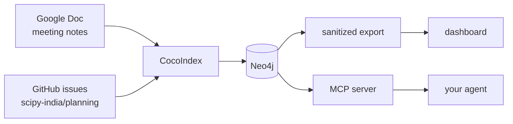

# SciPy India organizing tracker

We take notes in a Google Doc during organising calls and file tasks as issues
on the planning repo. This reads both and keeps track of who owns what, what is
still open, and which volunteer role it belongs to.

**[Dashboard](https://haleshot.github.io/scipy-india-organizing-tracker/)** ·
**[Docs](https://haleshot.github.io/scipy-india-organizing-tracker/docs/)**



The dashboard is built from an export that copies only allowlisted fields, so it
is safe to publish. The MCP server sits beside the private database on a laptop
and is not deployed.

No model runs unless you switch one on, and nothing is sent anywhere by default.
See [How AI is used](https://haleshot.github.io/scipy-india-organizing-tracker/docs/how-ai-is-used/).

## Running it

```bash
python -m venv .venv && source .venv/bin/activate
pip install -e ".[dev]"
cp .env.example .env
docker compose up -d --wait
./scripts/refresh.sh
python -m http.server 8000 --directory web/public
```

That builds a graph from the notes in `data/meeting_notes/`, with no credentials
needed. Pointing it at the team's real Doc and issue tracker is
[Connecting the sources](https://haleshot.github.io/scipy-india-organizing-tracker/docs/connecting-sources/).

After that, `./scripts/refresh.sh` is the whole loop.

## Tests

```bash
pytest -q
ruff check . && ruff format --check .
```

The Neo4j-backed tests skip cleanly when it is not running.
