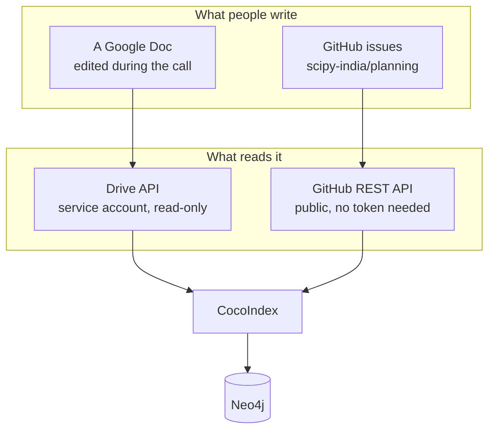

# Connecting the sources

Out of the box this reads a file in `data/meeting_notes/`, which is enough to
try it but means somebody has to keep downloading the Doc. Pointed at the real
sources, it reads the team's Google Doc and the planning issue tracker directly.

There are two sources because the notes record what a room agreed to and the
tracker records what somebody went and filed, and those drift apart within about
a week. Seeing where they disagree is most of the point.



## The Google Doc

### What happens when someone edits it

Somebody types a line into the Doc during a meeting. That is the whole of their
involvement; there is no form, no export step, no second place to update.

Next time the pipeline runs, the Drive connector lists the folder, sees the Doc
has a newer modification time, and exports it as plain text. The extractor
splits that text into meetings, and CocoIndex compares each meeting section
against what it saw last time. Sections that did not change are skipped
entirely, so a run after one edited meeting does the work of one meeting. The
changed section is re-extracted, and the nodes and edges it produces replace
what that section produced before.

Deletions work the same way. Remove a task line and the task's edge to that
meeting goes; remove the whole meeting and everything only that meeting
contributed comes out. Nothing accumulates as debris.

!!! warning "Turn off Markdown detection after pasting"

    Google Docs converts Markdown on paste, which is what makes the formatted
    notes look right. Leaving it on afterwards means an underscore you type gets
    escaped, and `in_progress` exports as `in\_progress`, which matches no known
    status. The pipeline unescapes that, along with `[text](url)` links and
    labelled lines that Docs has run together, but the less it has to undo the
    better.

!!! note "Docs export as plain text, not Markdown"

    The Drive connector exports a Google Doc as `text/plain`, so `##` headings
    and `-` bullets are gone before the pipeline sees the text. That is why the
    note format is built out of plain labels like `Task:` and `Owner:` rather
    than Markdown structure. Both spellings parse identically, which
    `tests/test_note_formats.py` checks by extracting the same meeting from
    both and comparing.

### Setting it up

Follow [CocoIndex's own instructions](https://cocoindex.io/docs/connectors/google_drive/#setting-up-a-service-account)
to create a service account and download its JSON key. Then three things have
to be true, and getting any of them wrong produces an error that names a
different one:

1. The **Drive API is enabled** on the Google Cloud project.
2. The **folder is shared** with the service account's email address, the one
   that looks like `something@project.iam.gserviceaccount.com`. Add it as a
   Viewer. An unshared folder returns 404, which reads as a missing folder.
3. The **key file is somewhere the repository ignores**. Put it in `secrets/`.

Then in `.env`:

```bash
MEETING_NOTES_SOURCE=google_drive
GOOGLE_SERVICE_ACCOUNT_CREDENTIAL=./secrets/your-key.json
GOOGLE_DRIVE_ROOT_FOLDER_IDS=the-folder-id-from-the-url
```

The folder id is the part of the Drive URL after `/folders/`.

Rather than guessing which of the three is wrong, run:

```bash
python scripts/check_drive.py
```

It checks them in order, stops at the first thing that is not right, and tells
you what to do about it. On success it lists the files it can see and reads one,
which is the only real proof that the whole chain works.

### How to lay the folders out

`GOOGLE_DRIVE_ROOT_FOLDER_IDS` takes a comma-separated list, so several folders
can feed one graph:

```bash
GOOGLE_DRIVE_ROOT_FOLDER_IDS=folder-one,folder-two
```

Worth doing, and not mainly for tidiness. A folder shared with the service
account is readable in full: every file in it, including ones nobody meant as
meeting notes. A folder that is not shared is invisible, and no configuration
mistake can change that. The folder boundary is the strongest privacy control
available here, because it sits outside this repository entirely.

So put the organising team's meeting notes in their own folder and share only
that one. Volunteer applications, sponsor correspondence, anything with somebody
else's contact details in it, keep in a folder the service account has never
been given. The pipeline then cannot read them by accident, whatever gets
misconfigured later.

Files in a shared folder that are not meeting notes are read and produce
nothing, which is harmless but wasteful: the connector downloads them on every
scan. A planning document sitting alongside the notes is worth moving out.

### On publishing folder ids

A folder id and a Google Cloud project id are identifiers, not secrets. Knowing
the id of a folder gets nobody into it: access is controlled by sharing, and the
folder is shared with one service account you created. The same is true of the
project id, which is visible in every API URL Google prints.

The thing that matters is the JSON key file. It is a private key, and anyone
holding it can read whatever that service account can read. It belongs in
`secrets/`, which `.gitignore` covers, and it should never be pasted anywhere.
There is a test in this repository, `test_no_tracked_file_contains_a_private_key`,
that scans every tracked file for one and fails the build if it finds it.

If a key does leak, the fix is to delete it in the Google Cloud console and
download a new one. The folder id does not need to change.

## GitHub issues

```bash
ISSUE_SOURCE=github
GITHUB_REPOS=scipy-india/planning
```

That is the whole configuration for a public repository. GitHub allows 60
unauthenticated requests an hour from one address, which is plenty for a manual
refresh. Set `GITHUB_TOKEN` to raise that to 5000, which you want for anything
running on a schedule, and which is required for a private repository.

### Narrowing it to this conference

`scipy-india/planning` goes back to July 2025 and holds 43 issues, most of them
about things that are not this conference. Reading all of them buries the ten
that matter.

Two ways to narrow it, both applied by GitHub rather than after the fact, so a
filtered read is one request instead of forty.

=== "By label"

    ```bash title=".env"
    GITHUB_ISSUE_LABELS=conference
    ```

    The tidier answer, and the one to prefer once somebody has gone through and
    labelled things. Only issues carrying every label listed here are read, so
    one label is usually what you want.

    The label has to exist and be applied first. Creating it is a one-off:

    ```bash
    gh label create conference --repo scipy-india/planning       --description "Work for the SciPy India 2026 conference" --color 0054a6
    gh issue edit 44 --repo scipy-india/planning --add-label conference
    ```

=== "By date"

    ```bash title=".env"
    GITHUB_ISSUE_SINCE=2026-06-01
    ```

    Needs no labelling at all, which makes it the right first move. Only issues
    updated on or after that date are read.

    On this repository that cuts 43 issues to 10. Pick the date the team started
    treating the conference as the priority.

    The catch is that an old issue somebody comments on reappears, since the
    filter is on updated rather than created. That is usually what you want, and
    occasionally is not.

Leave both empty to read everything, which is the default.

Each issue becomes an `Issue` node carrying its number, title, state, labels,
milestone and assignees. Issue **bodies are not read**, partly because they are
long and partly because comment threads are where people paste things that
should not end up in a published graph.

Two edges connect issues to the rest:

`Person -[:WORKS_ON]-> Issue` comes from GitHub's assignees. A login only
becomes a person if `config/people.yaml` says who it belongs to, because nothing
about the string `Haleshot` reveals that it means Srihari. Unmapped logins stay
on the issue as text and the refresh prints them, so adding somebody is a
two-line edit.

`Issue -[:FILED_UNDER]-> Workgroup` comes from labels, and only when a label
names a volunteer role in `config/workgroups.yaml`. Any other label is left
alone rather than guessed at.

### Linking an issue to an action item

The interesting join is between a task the notes recorded and the issue tracking
it, and the pipeline will not infer that. Two things with similar titles are not
evidence that they are the same work. So a note says it explicitly:

```
Task: Apply to the FOSS United Events grant
ID: foss-united-grant
Workgroup: Sponsoring
Owner: Agriya Khetarpal
Issue: #44
Status: open
```

That produces `Task -[:TRACKED_BY]-> Issue`, and the dashboard then shows the
task's status from the notes beside the issue's state on GitHub. A bare `#44`
means the first repository in `GITHUB_REPOS`; write `owner/repo#44` for any
other. If the issue is not in what the source returned, the refresh says so
rather than making an edge to nothing.
