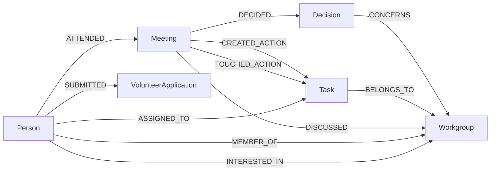

# The graph model

Node labels, relationship types, and the reasoning behind task identity, the
decision edges and the provenance fields.

Six node labels and ten relationship types, plus a singleton that records how
the graph was built.

| Node | Key | Properties |
| --- | --- | --- |
| `Meeting` | `id` | `note_file`, `date`, `title`, `summary`, `topics`, `section_index`, `source_ref`, `extraction_mode` |
| `Person` | `name` | canonical name after entity resolution |
| `Task` | `id` | `description`, `status`, `due`, `note_file`, `identity_basis`, `first_seen`, `last_seen`, `meeting_count`, `extraction_mode` |
| `Workgroup` | `slug` | `name`, `description` |
| `Decision` | `statement` | `note_file`, `first_seen`, `extraction_mode` |
| `VolunteerApplication` | `application_id` | `display_name`, `status`, `availability`, `interests`, `skills`, `submitted_on`, and the private `contact_email`, `contact_phone`, `raw_response` |
| `GraphBuild` | `id` | `built_at`, `pipeline_version`, `notes_source`, `volunteer_source`, `extraction_mode`, `person_resolution` |

Workgroups come from [config/workgroups.yaml](config/workgroups.yaml) and
nowhere else. That file also holds the aliases that let "Design", "design &
branding" and "Creatives" all land on one workgroup. A name that matches nothing
is dropped rather than invented, so an unregistered work area shows up as a gap
instead of a wrong edge.

### Decisions and action items are different things

The upstream example has no `Decision` node, so it spends `DECIDED` on the
meeting-to-task edge: there, a task *is* the thing that got decided. Once
decisions became their own nodes here that name stopped being true, so `DECIDED`
now points at the decision and action items get two edges of their own.
`CREATED_ACTION` marks the one meeting that first recorded an item.
`TOUCHED_ACTION` marks every meeting that mentioned it, carrying the status it
held at that point.

"Which meeting created this" and "how many meetings has this dragged through"
are now separate questions with separate answers, and the whole `open → blocked
→ in_progress` history lives in the graph rather than only in the prose. If you
know the upstream example, read `CREATED_ACTION` where you expect `DECIDED`.

### Task identity

Upstream keys a task by its description, and this project leaned on that: an
item repeated in a later meeting is the same item, which is how status moves
along. That recurrence is worth keeping. Description-only identity is not. Two
workgroups will eventually both write "Send the reminder email", and a
description-keyed graph merges them into one task with one status and two
unrelated owners without anything looking broken.

[src/scipy_india_kg/task_identity.py](src/scipy_india_kg/task_identity.py)
resolves a scoped key instead: an explicit `ID:` from the notes if there is one,
otherwise the workgroup plus the normalised description, otherwise the
description alone. Every key is also scoped to the source document so last
year's notes and this year's never merge. Normalisation folds case, whitespace
and trailing punctuation and nothing cleverer, because near-duplicate wording
staying two tasks is the safe direction to be wrong in. Which rule fired is
stored on the node as `identity_basis`.

### Provenance

Before trusting anything an LLM extracted you want to be able to ask why the
graph believes it, so every derived fact carries its source. `Meeting.source_ref`
points at `<note file>#section-<n>`. Meetings, tasks and decisions all record
which extractor produced them. `TOUCHED_ACTION` edges give a task's whole
appearance history with the status at each point, `ASSIGNED_TO.first_meeting_id`
credits the meeting that first named an owner, and `MEMBER_OF.source`
distinguishes a membership the team recorded in a meeting from one inferred from
a form field.

`./scripts/query get-task-history "Port the 2025 site"` prints all of it. Raw
source text is deliberately not copied into the graph, and none of this
provenance reaches the public snapshot beyond the build-mode names in the
dashboard footer.
