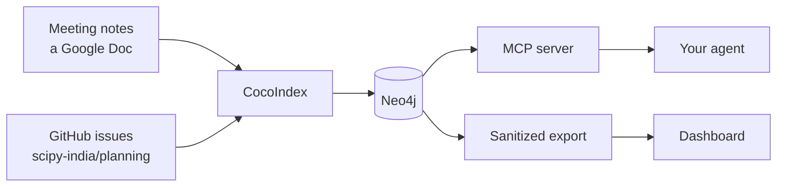

# SciPy India organizing graph

Running a conference generates a particular kind of mess. Decisions get made in
a call and written into a Doc that nobody reads again. Action items get agreed
and then live in someone's head. Tasks get filed as GitHub issues that drift out
of step with what the notes say. By month three, answering "did we ever decide
about the venue?" means scrolling.

This reads the notes and the issue tracker, and builds a graph out of them: the
meetings, who was in them, what they decided, the action items that came out,
who owns each one, and which volunteer role it belongs to. Then it lets you ask.

## The two halves

The graph has two readers and they never talk to each other, which is the
central design decision and worth understanding before anything else.

The **dashboard** is a static page built from a sanitized export. It answers
"show me where things stand" and it is safe to publish, because the exporter
copies only fields named in an allowlist and everything else stays behind.

The **MCP server** connects to the same Neo4j and gives an agent eleven
read-only tools. It answers "help me work out what to do next", and it runs on
your laptop next to the private graph. It is never deployed anywhere.

There is no server in between them. Nothing here has a login.

## Where to go

If you have never run this, [Get started](get-started.md) takes about five
minutes and needs no credentials: it ships with notes you can build a graph from
straight away.

If you are taking minutes at the next call, read
[Writing meeting notes](writing-notes.md). The format is plain labels typed
during the meeting, not a form to fill in afterwards, and it is the one contract
everything else depends on.

If you want it reading the team's real Doc and the real issue tracker, that is
[Connecting the sources](connecting-sources.md).

If you want to know why any of it is shaped the way it is, that is
[Design notes](design.md).

## Where it came from

It started as CocoIndex's
[meeting_notes_graph_neo4j](https://github.com/cocoindex-io/cocoindex/tree/main/examples/meeting_notes_graph_neo4j)
example, which is where the pipeline shape comes from: a document source,
per-section extraction, entity resolution, a property graph. The volunteer
roles, the issue source, the provenance tracking, the retrieval layer and the
privacy boundary are ours.
