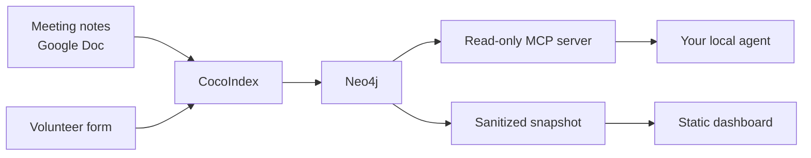

# SciPy India organizing graph

This turns the SciPy India organizing notes into a small Neo4j graph. The
meetings stay where they are, in one Google Doc that people write during a call,
and the graph keeps track of the decisions, the action items and who owns them,
the volunteer roles, and the people attached to each. That makes questions like
"what is still open?" or "what did we decide about the venue?" answerable
without rereading months of notes.

The graph has two readers, and they never talk to each other.

The dashboard answers "show me what is going on" and is safe to publish. The MCP
server answers "help me work with what is going on" and stays on your laptop
next to the private graph. Neither depends on the other, and there is no backend
in between.

## Where to start

If you have never run it, [Get started](get-started.md) is a clean-shell setup
that takes about a minute once Docker is up. If it is already running and you
have just downloaded a new copy of the notes, you want the
[weekly workflow](workflow.md), which is one command.

If you are taking minutes, read [writing meeting notes](meeting-notes-template.md)
first. The format is plain labels typed during the call, not a form to fill in
afterwards, and it is the one contract the whole pipeline depends on.

## What is fixture data and what is real

The [volunteer roles](volunteer-roles.md) are real: they come from the sign-up
form, along with how many people picked each one. Nothing else from that form is
in this repository, and no applicant is named anywhere.

The meeting notes in `data/meeting_notes/` and the volunteer applications in
`data/volunteers/` are invented, so the whole thing runs and can be reviewed
without touching anyone's data. Every address in them ends in `@example.invalid`.

It started as CocoIndex's
[meeting_notes_graph_neo4j](https://github.com/cocoindex-io/cocoindex/tree/main/examples/meeting_notes_graph_neo4j)
example, which is where the pipeline shape comes from. The roles, the volunteer
applications, the provenance and the retrieval layer are ours.
