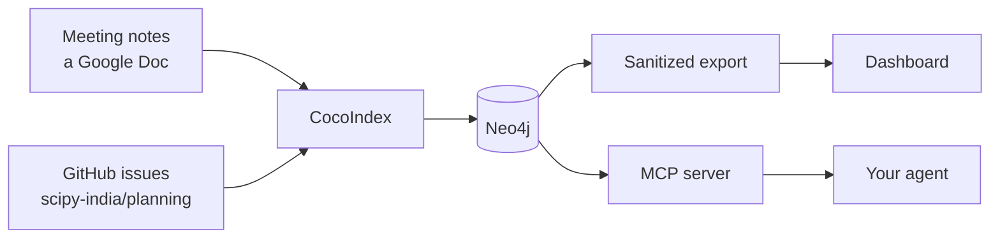

# SciPy India organizing graph

Conference planning leaks. A decision gets made on a call and written into a Doc
nobody opens again, an action item gets agreed and then lives in one person's
head, and the issue tracker drifts out of step with both. Three months in,
answering "did we ever sort out the venue?" means scrolling.

This reads the meeting notes and the planning tracker and builds a graph out of
them: meetings, who was in them, what they decided, the action items that came
out, who owns each one, and which volunteer role it belongs to.

Most people want the dashboard, which is a page you look at.
[Reading the dashboard](reading-the-dashboard.md) explains what is on it and how
the numbers are worked out. That is probably the page you want.

The published dashboard is built from a sanitized export, not from the database.
The exporter copies only fields named in an allowlist, so contact details and
volunteer form answers stay behind even if somebody adds them to the graph
later. [What gets published](privacy.md) covers where that line sits.

The MCP server is the other reader. It connects to the same Neo4j and gives an
agent thirteen read-only tools, so you can ask "what is open in sponsoring and
who has it" instead of writing a query. It runs on a laptop next to the private
database and is never deployed.

No model runs unless you turn one on, and nothing is sent anywhere by default.
[How AI is used](how-ai-is-used.md) says what each of the three optional model
paths would send, and why you might decline all of them.

## Running your own

The setup pages are for the smaller group who want their own copy pointed at
their own notes. [Get started](get-started.md) needs no credentials and builds a
graph from the notes bundled with the repository.

If you are taking minutes at the next call and the pipeline is already running,
the page you need is [Writing meeting notes](writing-notes.md). The format is
plain labels typed during the meeting rather than a form filled in afterwards,
and it is the one thing everything else depends on.

## Where it came from

It started as CocoIndex's
[meeting_notes_graph_neo4j](https://github.com/cocoindex-io/cocoindex/tree/main/examples/meeting_notes_graph_neo4j)
example, which is where the pipeline shape comes from: a document source,
per-section extraction, entity resolution, a property graph. The volunteer
roles, the issue source, the provenance tracking, the retrieval layer and the
privacy boundary were added here.
