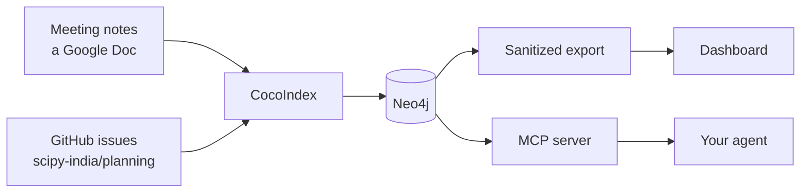

# SciPy India organizing tracker

We take notes in a Google Doc during organising calls, and we file tasks as
issues on the planning repo. Both are fine on their own. Together they get hard
to hold in your head: who agreed to do what, which volunteer role it sits under,
and what nobody has picked up yet.

This reads both and keeps track of that for you. It ends up as a dashboard you
can open and a set of questions you can ask.

-   __Just want to look at it?__

    ---

    [Open the dashboard](../){ target=_blank }, then come back here for what
    each page shows and how the numbers are worked out.

    [Reading the dashboard](reading-the-dashboard.md){ .md-button }

-   __Want to run your own copy?__

    ---

    About five minutes, no credentials. It ships with notes you can build from
    straight away.

    [Get started](get-started.md){ .md-button }

-   __Taking minutes at the next call?__

    ---

    The note format. Plain labels you type during the meeting, nothing to fill
    in afterwards.

    [Writing meeting notes](writing-notes.md){ .md-button }

-   __Wondering what it does with your data?__

    ---

    Nothing is sent anywhere by default. Here is what each optional model would
    see if you turned it on.

    [How AI is used](how-ai-is-used.md){ .md-button }

## How it fits together

Notes and issues go into a database. Two things read that database and they
never talk to each other.

The dashboard is built from an export, not from the database itself. The
exporter copies only the fields on a list, so contact details and form answers
do not reach it even if somebody adds them to the database later.
[What gets published](privacy.md) covers where that line sits and why.

The other reader is an MCP server. It gives an agent thirteen read-only tools,
so instead of writing a query you can ask what is open in sponsoring and who has
it. That one runs on a laptop next to the private database and is not deployed
anywhere.

## What it is for

The point is deciding what to hand to which volunteer. Once the graph knows who
owns what, which roles have work sitting unclaimed, and who has already said
they are interested in an area, matching people to jobs stops being a memory
exercise.

Right now it is running on the three of us, which is small enough to check the
whole thing by eye before anyone else's name goes near it.

## Where it came from

CocoIndex ships an example called
[meeting_notes_graph_neo4j](https://github.com/cocoindex-io/cocoindex/tree/main/examples/meeting_notes_graph_neo4j),
and that is where the shape comes from: read a document, pull structure out of
each section, work out which names are the same person, write a graph. The
volunteer roles, the GitHub source, the provenance tracking, the query layer and
the export boundary were added on top.
