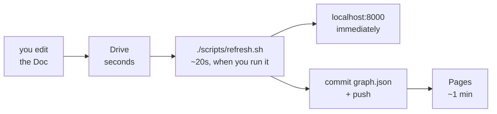

# Keeping it current

One command rebuilds everything that comes from the sources:

```bash
./scripts/refresh.sh
```

Three stages, in this order because each needs the one before it. The graph gets
built from the notes and the tracker, the search indexes get built from the
graph, and the dashboard's data file gets exported from the graph and checked
before it is written.

Everything is incremental. A meeting section whose text has not changed is
matched against its cached extraction and skipped, so a refresh after one edited
meeting costs about the same as a refresh after none.

```title="a run after one edited meeting"
1/3  Graph
  ✅ process_note_file: 1 total | 1 reprocessed
  Issue: 43 -> 43
  Task: 22 -> 23

2/3  Search indexes
  vector    task_embedding_index    1 embedded, 22 already current, 384 dims

3/3  Dashboard snapshot
  Wrote web/public/data/graph.json: 5 meetings, 3 people, 23 tasks
  privacy checks passed

Done
  Graph written to: bolt://127.0.0.1:7687 (database neo4j)
```

That last line matters more than it looks. See
[which database am I looking at](neo4j-desktop.md#which-database-am-i-looking-at).

## How long an edit takes to show up

Nothing watches the Doc. Editing it changes nothing anywhere until somebody runs
the refresh, and there are four places the change has to travel through.



Google saves your edit within seconds and the Drive API sees it right away, so
that part is never the delay. Everything after it waits on you.

| What you want | What to run | How long |
| --- | --- | --- |
| See it locally | `./scripts/refresh.sh`, then reload | About 20 seconds |
| See it while editing | `./scripts/refresh.sh --watch` in one terminal | Picks it up on the next cycle |
| Get it onto the published dashboard | Refresh, commit `web/public/data/graph.json`, push | About a minute after the push |

The published dashboard reads a committed file, not the database, so a refresh
that stays on your laptop changes nothing anyone else can see. That is the step
people forget.

```bash title="edit the Doc, then publish it"
./scripts/refresh.sh
git add web/public/data/graph.json
git commit -S --signoff -m "chore: refresh the snapshot"
git push
```

!!! tip "Working through a batch of edits"

    `--watch` re-runs the whole refresh whenever the notes change, so you can
    keep the dashboard open on one screen and the Doc on another.

    ```bash
    ./scripts/refresh.sh --watch     # needs fswatch
    python -m http.server 8000 --directory web/public
    ```

    How it waits depends on the source. A local directory has filesystem
    events, so it reacts the moment you save. Google Drive has none and there is
    no webhook here to receive one, so it polls every 60 seconds instead. Set
    `WATCH_INTERVAL_SECONDS` to change that; a cycle with no edits is cheap,
    because every unchanged meeting section matches its cache.

Commit the snapshot once at the end rather than after every edit. Every push
triggers a deploy, and the history is easier to read.

## Flags

| Flag | When you want it |
| --- | --- |
| `--check` | Report what is stale, write nothing. Good in CI, or when you are not sure somebody else already ran it |
| `--reset` | Empty the graph and rebuild. After changing something structural, like a workgroup slug, where incremental updates leave the old version behind |
| `--watch` | Re-run whenever the notes change. Needs `fswatch` |
| `--no-search` | Skip the indexes |
| `--force` | Re-embed everything |

## Doing it on a schedule

`.github/workflows/refresh-graph.yml` runs every three hours, reads the Doc and
the tracker, and publishes the result. Nobody has to remember anything.

It works without a hosted database. The graph is derived entirely from the
sources, so nothing needs to survive between runs: the job starts a throwaway
Neo4j beside itself, builds the whole graph into it, exports the snapshot, and
throws the database away. A run that finds no edits writes nothing and publishes
nothing.

No model runs in it either. The deterministic parser and exact name matching
need no API key, so the only places anything is sent are Google and GitHub.

!!! warning "It needs two secrets before it can do anything"

    Until these are set the scheduled run fails on its first step, which is
    deliberate: a green run that quietly published nothing would be worse.

    ```bash
    gh secret set GOOGLE_SERVICE_ACCOUNT_JSON < secrets/your-key.json
    gh secret set GOOGLE_DRIVE_ROOT_FOLDER_IDS --body "id-one,id-two"
    ```

    The first is the whole JSON key file. GitHub encrypts secrets and does not
    show them again, including to you. Issues need nothing extra, because the
    repository's own token can read them.

Run it by hand any time from the Actions tab, and tick "Rebuild from scratch" if
something looks stale.

### A cron entry instead

Worth it if you would rather the key stayed on a machine you own.

??? example "Installing a cron entry yourself"

    ```bash title="crontab -e"
    # Every weekday at 9am. Absolute paths, because cron has almost no PATH.
    0 9 * * 1-5 cd /path/to/scipy-india-organizing-tracker && ./scripts/refresh.sh >> refresh.log 2>&1
    ```

    Two things to know. The GitHub source allows 60 unauthenticated requests an
    hour, so set `GITHUB_TOKEN` before running this often. And a scheduled
    refresh that fails is silent unless you read the log, which is the usual
    reason people go back to running it by hand.

## Putting the dashboard online

`web/public` is the deployable directory as it stands. No build step, Cytoscape
is vendored rather than pulled from a CDN, every URL is relative and routing
uses the hash, so it behaves the same at a project path as at a domain root.

For GitHub Pages, push the repository and set Settings, Pages, Source to GitHub
Actions. The first deploy works on the committed snapshot with no database and
no secrets, which is a good way to check the plumbing before pointing anything
real at it.

The workflow refuses to deploy a snapshot whose profile is not `public`, so an
organiser export cannot go out by accident.

To check a project-path deploy locally first, since that is where relative URLs
usually break:

```bash
mkdir -p /tmp/pages/scipy-india-organizing-tracker && cp -R web/public/* /tmp/pages/scipy-india-organizing-tracker/
python -m http.server 8000 --directory /tmp/pages
```

## Live mode is a different thing

```bash
cocoindex -d src update -L scipy_india_kg.main
```

This keeps Neo4j current and nothing else. It re-runs every
`LIVE_REFRESH_SECONDS`, 20 by default, and memoisation makes a cycle with no
edits nearly free.

What it does not touch is the dashboard export or the vector indexes, so after
an edit the graph and the dashboard disagree. Live mode is for working on the
pipeline; `./scripts/refresh.sh --watch` is for working on the notes.

## If you are downloading the Doc by hand

With `MEETING_NOTES_SOURCE=local` the pipeline reads every note file in
`data/meeting_notes/`. Downloading the Doc again usually gives you a new
filename, so `SciPy India 2026 Meeting Notes (1).md` lands beside the one
already there, both get read, and every meeting appears twice.

That is an error rather than a silent merge: two files claiming the same meeting
date and title stops the run and names both filenames. Overwriting works, and so
does deleting the old file first, since CocoIndex removes what a deleted file
contributed.

Connecting the Doc directly makes the whole problem go away. See
[Connecting the sources](connecting-sources.md).
